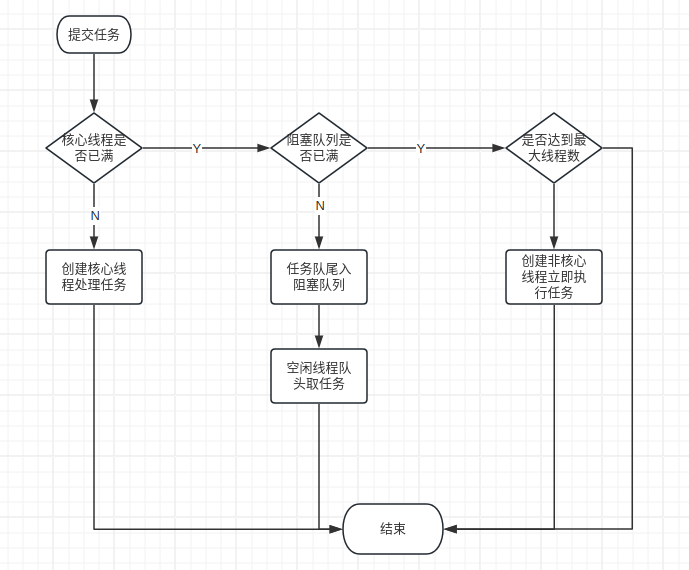

# Java线程池基本


这篇文章Java线程池的基本知识.

<!--more-->


这篇文章借鉴了一篇很棒的[一文详解 | Java线程池及其应用](https://zhuanlan.zhihu.com/p/394688518).


# Java线程池介绍

## 1.为什么要使用线程池

随着计算机处理能力的提高，计算机能在同一时刻处理多种任务，在操作系统中，进程代表着程序的一次运行，线程是比进程更小的单元。进程是资源分配的基本单位，同一个进程了可以申请多个线程，多个线程共用该进程的资源。Java虚拟机创建线程是通过调用底层C语言在操作系统层面创建一个内核线程，JVM中的线程只是一个钩子，JVM中线程的创建和销毁涉及到操作系统内核的创建和切换，比较消耗系统资源。因为使用池化技术来管理线程，可以有效的减少操作系统内核层面的操作，降低消耗。

***


## 2.线程池创建构造方法
* 核心线程数（Core Pool Size）：表示核心线程的数量。所谓核心线程，是在"大多数情况下（未开启allowCoreThreadTimeOut参数）"都不会被销毁的线程（即使它们一直处于空闲状态）；
* 最大线程数（Max Pool Size）：当任务堆积，且池中没有空闲的核心线程来处理任务时，线程池会创建一些临时的线程来处理堆积的任务。这些临时的线程会在空闲一定时间后被销毁掉， 最大的临时线程数量为MaxPoolSize - CorePoolSize；
* 存活时间（Keep Alive Time）：分为具体的数值和单位，如60s。表示临时线程空闲存活时间（在开启allowCoreThreadTimeOut参数后也表示核心线程的空闲存活时间）。 当临时线程空闲时间超过该值之后，就会被销毁掉；
* 工作队列（Work Queue）：存放挤压的任务；
* 拒绝策略（Reject Handler）：当线程池的线程数量已经达到上限（Max Pool Size），全部都处于非空闲的状态，且工作队列已满无法再堆积任务时， 会按照预先设定的方式拒绝新的任务；

## 3.线程池任务分配过程



## 4.常见线程池工作队列
1. ArrayBlockingQueue属于有界队列，在构造时，必须指定其容量。底层存储结构为数组，利用"双指针"的形式确定读取和写入的索引。其内部只有一把锁供读取和写入操作同时使用，从而无法实现读写并行
2. LinkedBlockingQueue构造时，可以指定其容量，或不指定容量。在不指定容量时，属于无界队列（理论上，实际上最大容量为Integer.MAX_VALUE）。底层数据结构为链表。读锁和写锁分离，通过AtomicInteger的count字段来判断能否读或写，吞吐量非常高。但受链表特性的影响，在高并发场景下，会频繁新增或删除节点，从而导致频繁的GC。
3. PriorityBlockingQueue优先级队列，能够提供有序的数据消费顺序。构造时可以指定比较器（Comparator）。在不指定比较器的情况下，存入的数据必须是可比较的（Comparable）。属于无界队列，底层是基于数组实现的二叉堆，默认初始容量为11，在容量不足的情况下会自动扩容。其读取和写入操作共享同一把锁
4. SynchronousQueue同步队列，本质上没有任何存储空间，当生产者存入数据时，立即会被阻塞住，直到有消费者消费这个数据。同理，当消费者消费数据时，如果队列中没有数据，则消费者会被阻塞住，直到获取到数据为止。**其提供了公平和非公平两种模式，可以通过构造函数确定。公平模式下，其内部数据结构为SynchronousQueue.TransferQueue。非公平模式下，其内部数据结构为SynchronousQueue.TransferStack。**
*SynchronousQueue先自旋，超过一定次数之后再加锁。效率较高 *
5. DelayQueue延时队列，无界，其只能存储java.util.concurrent.Delayed类型的数据。底层基于PriorityBlockingQueue实现
***

## 5.常见拒绝策略
1. AbortPolicy这是默认的拒绝策略。当线程池无法容纳更多任务，且还有新任务提交时，会抛出RejectedExecutionException异常
2. DiscardPolicy 静默拒绝策略。同AbortPolicy类似，但不会抛出异常
3. DiscardOldestPolicy 该策略会丢弃掉工作队列中等待时间最长的任务，也就是当前队列中的第一个任务，并将新的任务添加到队列尾部
4. CallerRunsPolicy 该策略会使得线程池在无法容纳更多任务且同时有新任务提交时，交由调用者所在线程来执行任务。
5. 自定义拒绝策略，实现RejectedExecutionHandler并重写rejectedExecution方法
***

## 6.快速创建线程池方法
### 6.1 FixedThreadPool固定大小的线程池
构造方法如下：
```java
public static ExecutorService newFixedThreadPool(int nThreads) {
    return new ThreadPoolExecutor(nThreads, nThreads, 0L,    		               TimeUnit.MILLISECONDS, new LinkedBlockingQueue());
}
```
*该线程池的核心线程数和最大线程数保持一致，且使用的无界队列（LinkedBlockingQueue）。没有指定拒绝策略，则使用默认的AbortPolicy策略。不过由于其使用的是无界队列，在高并发的情况下，出现的应该是OutOfMemoryError

### 6.2 CachedThreadPool这是一个能够缓存线程的线程池
构造方法如下：
```java
public static ExecutorService newCachedThreadPool() {
    return new ThreadPoolExecutor(0, Integer.MAX_VALUE, 60L, TimeUnit.SECONDS, new SynchronousQueue());
}
```
*该线程池没有核心线程，理论上可以创建无限的临时线程，临时线程的空闲存活时间为60s。注意，该线程池使用的是SynchronousQueue，上文中已经提到，SynchronousQueue是没有实际存储空间的，因此当没有空闲临时线程来处理新任务时，该线程池都会新创建一个临时线程来处理新的任务。CachedThreadPool适合于"固定时间段内产生大量流量"的场景，比如说"限时抢购"。它会在高峰时间段内尽可能创建多的线程来处理业务，并在高峰期结束后回收掉大量的临时线程，从而不占用系统过多的资源。不过，由于其的临时线程数是"没有上限"的，所以也会产生OutOfMemoryError

### 6.3 SingleThreadExecutor只有一个线程的线程池
构造方法如下
```java
return new FinalizableDelegatedExecutorService
            (new ThreadPoolExecutor(1, 1,
            0L, TimeUnit.MILLISECONDS,
            new LinkedBlockingQueue<Runnable>()));
```
*其使用的是无界队列（LinkedBlockingQueue）。当开发者期望任务能够以串行的方式执行时，可以考虑使用SingleThreadExecutor。不过该线程池缺点也非常明显。其使用一个线程来执行所有的任务，速度肯定较慢，容易造成任务堆积，容易产生OutOfMemoryError

### 6.4 ScheduledThreadPool可执行定时任务的线程池
构造方法
```java
public ScheduledThreadPoolExecutor(int corePoolSize) {
    super(corePoolSize, Integer.MAX_VALUE, 10L, TimeUnit.MILLISECONDS, new ScheduledThreadPoolExecutor.DelayedWorkQueue());
}
```
*其理论上可以创建无限的临时线程，从而导致OutOfMemoryError，不过在实际使用中，不会存在太多的定时任务，因此OutOfMemoryError的情况基本上不会出现


